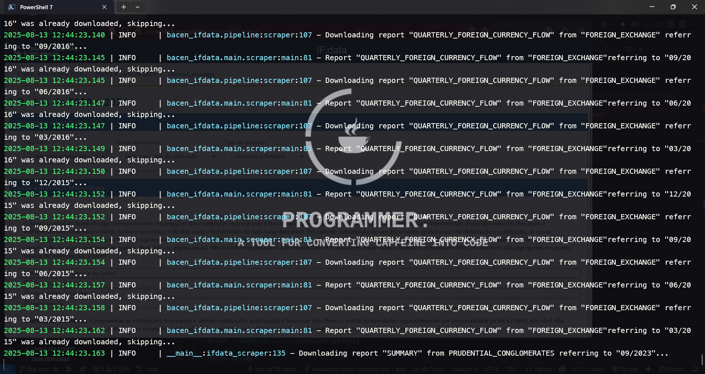
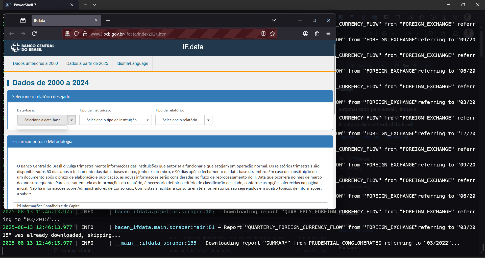

# Bacen IF.data AutoScraper & Data Manager

[](https://www.linkedin.com/in/alexcamargos)

[](LICENSE)

*Um scraper e processador de dados automatizado para extrair, limpar e organizar relatórios financeiros do portal IF.data do Banco Central do Brasil.*

[](https://www.python.org/)
[](https://python-poetry.org/)
[](https://www.selenium.dev/)


Este projeto automatiza a coleta e o processamento dos relatórios financeiros disponibilizados pelo Banco Central do Brasil através do portal IF.data. Diante do desafio de extrair dados valiosos de um formato de CSV não padronizado e de um processo de download manual, esta ferramenta utiliza **Selenium** para a automação da navegação e download, e scripts **Python** para a limpeza e estruturação dos dados.

O objetivo é transformar os dados brutos e inconsistentes do Bacen em um conjunto de dados limpo, organizado e pronto para análise, eliminando a necessidade de trabalho manual e garantindo a precisão das informações.


**Sumário**
- [Bacen IF.data AutoScraper \& Data Manager](#bacen-ifdata-autoscraper--data-manager)
  - [Tecnologias Utilizadas](#tecnologias-utilizadas)
  - [Funcionalidades Principais](#funcionalidades-principais)
  - [Demonstração de Execução](#demonstração-de-execução)
  - [Motivação](#motivação)
  - [O Portal IF.Data](#o-portal-ifdata)
  - [O Banco Central do Brasil](#o-banco-central-do-brasil)
  - [Objetivo Geral](#objetivo-geral)
  - [Instalação](#instalação)
    - [Usando Poetry](#usando-poetry)
    - [Sem usar Poetry](#sem-usar-poetry)
  - [Capturando os arquivos](#capturando-os-arquivos)
  - [Processando os arquivos](#processando-os-arquivos)
  - [Desafios e Aprendizados](#desafios-e-aprendizados)
  - [Autor](#autor)
  - [Copyright](#copyright)
  - [License](#license)


## Tecnologias Utilizadas

* **Linguagem Principal:** Python
* **Gerenciador de Dependências:** Poetry
* **Automação Web (Scraping):** Selenium
* **Web Driver:** GeckoDriver (para Firefox)


## Funcionalidades Principais

- [x] **Automação de Download:** Realiza o download automático de todos os relatórios CSV do portal IF.data para um determinado período.
- [x] **Setup Simplificado:** Suporte para instalação de dependências e execução com e sem Poetry.
- [x] **Processamento e Limpeza de CSVs:** Corrige arquivos CSV com formatação não-padrão, removendo cabeçalhos e informações consolidadas indesejadas.
- [x] **Relatório de Execução:** Gera um relatório ao final da execução com o total de arquivos baixados e o tempo de execução.


## Demonstração de Execução

Veja o pipeline de automação em ação.






## Motivação

Embora o Bacen disponibilize dados para o público em geral, com o objetivo de atender ao disposto na Lei 12.527 de 2011 (popularmente conhecida como Lei de Acesso à Informação), a forma como esses dados são apresentados exige a aplicação de métodos especializados para sua interpretação. É necessário empregar uma série de procedimentos e técnicas para extrair informações mais sofisticadas desses dados. A utilização de algoritmos e técnicas de tratamento e mineração de dados é fundamental nesse contexto. Essas abordagens permitem a extração de insights mais complexos dos dados fornecidos pelo Bacen, facilitando análises mais profundas e detalhadas sobre o sistema financeiro brasileiro.

## O Portal IF.Data

O Portal IF.Data, criado pelo Banco Central do Brasil (Bacen), atende às exigências da Lei de Acesso à Informação ([Lei 12.527 de 2011](https://www.planalto.gov.br/ccivil_03/_ato2011-2014/2011/lei/l12527.htm)). Essa legislação obriga o poder público a publicar informações na internet de maneira acessível e em formatos compatíveis com processamento automatizado. O portal se caracteriza por ser interativo, armazenando e disponibilizando uma série de relatórios sobre instituições financeiras. Estes relatórios, que são atualizados trimestralmente, incluem dados abertos e podem ser visualizados online ou baixados em formato .csv.

No Portal IF.Data, é possível encontrar dados relacionados a contabilidade e capital, crédito, câmbio e segmentação das instituições financeiras. O portal abrange dados desde o ano 2000, e também oferece acesso a informações anteriores, de 1994 a 2000, embora em formatos diferentes. Para acessar os dados, o usuário pode selecionar no portal o trimestre de interesse, o tipo de instituição financeira e o relatório desejado.

## O Banco Central do Brasil

O Banco Central do Brasil, frequentemente referido como Bacen, é a autoridade monetária principal do Brasil e desempenha um papel crucial na economia do país. Sua principal função é garantir a estabilidade do poder de compra da moeda nacional, o Real, e manter um sistema financeiro sólido e eficiente. Para isso, o Bacen regula a quantidade de dinheiro em circulação, administra as reservas internacionais do país, e atua como um regulador e supervisor do sistema financeiro, controlando e fiscalizando as instituições financeiras. Além disso, é responsável pela formulação e execução da política monetária, buscando controlar a inflação e influenciar as atividades econômicas. Como parte de suas funções, o Bacen também coleta e divulga dados econômicos e financeiros importantes, como os disponibilizados no Portal IF.Data, para garantir transparência e acesso à informação para o público em geral e para instituições financeiras.

## Objetivo Geral

Este projeto visa aprimorar a coleta e o processamento de dados através da automação de atividades em navegadores web, utilizando a biblioteca [Selenium](https://www.selenium.dev). Selenium é uma ferramenta poderosa para a automação de browsers, permitindo a extração eficiente de dados de diversas fontes online. Após a coleta, o projeto focará no agrupamento e tratamento desses dados, organizando-os de maneira sistemática e coerente.

Essa abordagem não só economiza tempo e recursos, eliminando a necessidade de coleta manual de dados, mas também aumenta a precisão e a confiabilidade das informações obtidas. A fase de tratamento dos dados é crucial, pois envolve limpeza, normalização e consolidação de informações de múltiplas fontes, preparando-as para análises mais aprofundadas.

O resultado final será um conjunto de dados estruturado e de fácil acesso, proporcionando uma base sólida para análises futuras. Este conjunto de dados permitirá aos analistas e pesquisadores extrair insights valiosos e realizar avaliações detalhadas em seus respectivos campos de estudo ou indústrias. Além disso, o uso de automação e tratamento avançado de dados representa um passo importante na direção da modernização e eficiência dos processos de coleta e análise de dados.

## Instalação

```bash
git clone https://github.com/alexcamargos/bacen-ifdata-scraper.git
```

### Usando Poetry

```bash
poetry install
```

### Sem usar Poetry

Para criar e ativar um ambiente virtual de desenvolvimento, utilize o módulo [venv](https://docs.python.org/pt-br/3/library/venv.html) do Python. Este processo pode variar ligeiramente dependendo do sistema operacional que você está utilizando. Recomenda-se consultar a documentação oficial para orientações específicas caso não esteja usando um sistema GNU/Linux. Siga os comandos abaixo para configurar seu ambiente:

```bash
python -m venv .venv

.venv /bin/activate

pip install -r requirements.txt
```

> Observação: No Windows, use .venv\Scripts\activate para ativar o ambiente virtual.

## Capturando os arquivos

> Antes de iniciar o processo de captura, certifique-se de que o GeckoDriver esteja devidamente instalado e configurado no seu sistema.

```bash
poetry run .\ifdata.py -s
```

> Observação: Caso não esteja utilizando Poetry, execute *python scraping.py*

O script será inicializado e exibirá, em tempo real, quais arquivos estão sendo baixados. Após a conclusão, um relatório será gerado, detalhando o número total de arquivos baixados e o tempo total de execução.

## Processando os arquivos

Os desenvolvedores responsáveis pelo site do Bacen desviaram do formato padrão de CSV. Eles implementaram uma abordagem incomum ao incluir agrupamentos de cabeçalhos e informações consolidadas do tipo e segmentação das instituições financeiras, dentro do arquivo CSV. Para garantirmos que temos arquivos que podem ser facilmente trabalhados precisamos corrigir essas inconsistências.

Os desenvolvedores do site do Bacen adotaram uma abordagem não convencional para o formato de arquivos CSV. Eles incorporaram agrupamentos de cabeçalhos e informações consolidadas do tipo e segmentação das instituições financeiras, diretamente nos arquivos CSV. Para assegurar que os arquivos sejam facilmente manuseáveis e úteis, é essencial corrigir essas inconsistências e alinhá-las com os padrões convencionais de CSV."

```bash
poetry run .\ifdata.py -c
```

> Observação: Caso não esteja utilizando Poetry, execute *python process.py*


## Desafios e Aprendizados

* **Desafio: Construção de um Pipeline de Dados de Ponta a Ponta**
    * **Problema:** As informações financeiras do Bacen, apesar de públicas, não são disponibilizadas através de uma API. Elas estão "presas" em um portal web que exige navegação manual e os arquivos para download estão em um formato inconsistente e "sujo". Para realizar qualquer análise séria e replicável, era necessário um sistema que superasse essas barreiras.
    * **Solução:** Projetei e implementei um pipeline de dados em duas etapas:
        1.  **Extração (Extract):** Um scraper automatizado com Selenium que simula a interação humana com o portal IF.data, navegando pelos menus e realizando o download sistemático de todos os relatórios necessários.
        2.  **Transformação (Transform):** Um módulo de processamento em Python que recebe os arquivos brutos baixados, aplica as regras de limpeza para corrigir a formatação não-padrão e salva uma versão limpa e estruturada, pronta para ser carregada em ferramentas de análise.
    * **Aprendizado:** Este projeto foi um exercício prático completo de **Engenharia de Dados (ETL - Extract, Transform, Load)**. Aprendi a decompor um problema complexo em etapas lógicas, selecionar as ferramentas adequadas para cada fase (Selenium para interação com UI, Python para manipulação de dados) e a construir um fluxo de trabalho automatizado e confiável. O resultado final não é apenas um conjunto de dados, mas um **sistema replicável que transforma uma fonte de dados manual e não confiável em um ativo de informação pronto para análise**.

* **Desafio: Parsing de CSVs Não-Padronizados**
    * **Problema:** Os arquivos CSV disponibilizados pelo Bacen não seguem o padrão convencional. Eles incluem múltiplos cabeçalhos, linhas de resumo e agrupamentos de dados dentro do mesmo arquivo, tornando a importação direta com bibliotecas padrão (como Pandas) inviável e resultando em dataframes corrompidos.
    * **Solução:** Desenvolvi um script de processamento em Python que lê cada arquivo linha por linha. Utilizando lógica condicional, o script identifica e ignora os cabeçalhos secundários e as linhas de resumo. Ele localiza o cabeçalho principal correto e extrai apenas as linhas de dados pertencentes às instituições financeiras, reescrevendo um novo arquivo CSV limpo e bem formatado.
    * **Aprendizado:** Este desafio aprofundou minhas habilidades em manipulação de arquivos e parsing de texto em baixo nível. Aprendi a importância de não confiar cegamente em formatos de arquivo e a desenvolver soluções robustas para lidar com dados sujos e inconsistentes, uma habilidade fundamental em qualquer projeto de engenharia ou ciência de dados.


## Autor

Feito com :heart: por [Alexsander Lopes Camargos](https://github.com/alexcamargos) :wave: Entre em contato!

[](https://github.com/alexcamargos)
[](https://twitter.com/alcamargos)
[](https://www.linkedin.com/in/alexcamargos/)
[](mailto:alcamargos@vivaldi.net)

## Copyright

Copyright 2023 - 2025 by Alexsander Lopes Camargos.

## License

[MIT License](LICENSE)
