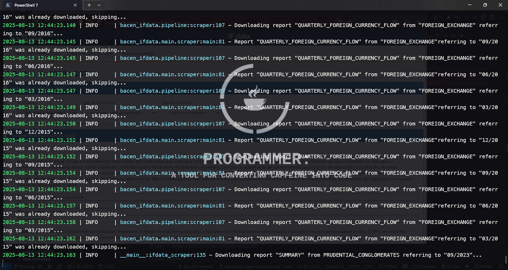
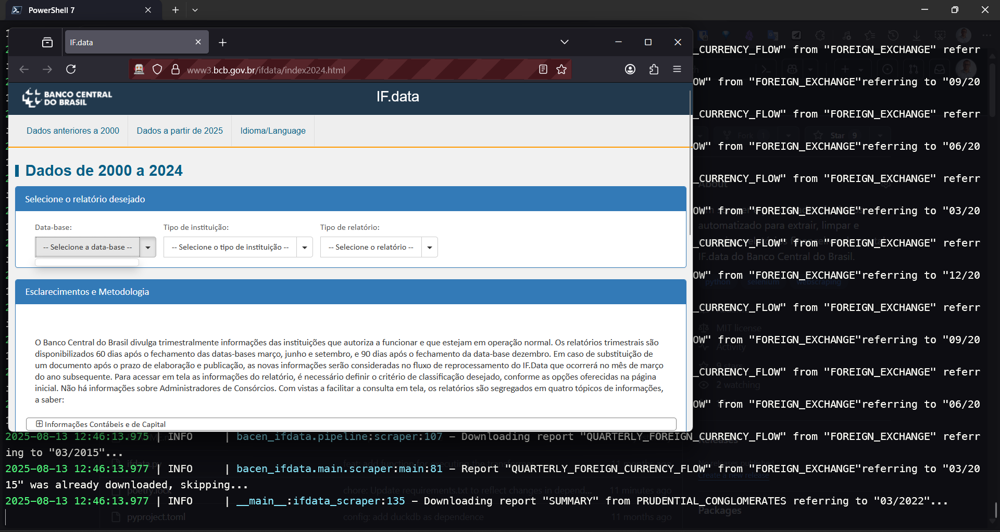

# Bacen IF.data AutoScraper & Data Manager

[](https://www.linkedin.com/in/alexcamargos)

[](LICENSE)

*Um sistema ETL ponta a ponta para extrair, transformar e carregar relatórios financeiros do portal IF.data do Banco Central do Brasil.*

[](https://www.python.org/)
[](https://github.com/astral-sh/uv)
[](https://www.selenium.dev/)
[](https://pola.rs/)
[](https://duckdb.org/)

Este projeto automatiza a coleta, o processamento e a carga dos relatórios financeiros disponibilizados pelo Banco Central do Brasil através do portal IF.data. Diante do desafio de extrair dados valiosos de um formato de CSV não padronizado e de um processo de download manual, esta ferramenta utiliza **Selenium** para a automação da navegação e download, e scripts **Python** com **Polars** e **DuckDB** para a limpeza, transformação e estruturação dos dados.

O objetivo é transformar os dados brutos e inconsistentes do Bacen em um conjunto de dados limpo, organizado e pronto para análise, eliminando a necessidade de trabalho manual e garantindo a precisão das informações através de um pipeline ETL (Extract, Transform, Load) completo.

**Sumário**

- [Bacen IF.data AutoScraper \& Data Manager](#bacen-ifdata-autoscraper--data-manager)
  - [Tecnologias Utilizadas](#tecnologias-utilizadas)
  - [Funcionalidades Principais](#funcionalidades-principais)
  - [Demonstração de Execução](#demonstração-de-execução)
  - [Motivação](#motivação)
  - [O Portal IF.Data](#o-portal-ifdata)
  - [O Banco Central do Brasil](#o-banco-central-do-brasil)
  - [Objetivo Geral](#objetivo-geral)
  - [Instalação](#instalação)
  - [Uso do Pipeline](#uso-do-pipeline)
    - [Extração (Scraping)](#extração-scraping)
    - [Limpeza (Cleaning)](#limpeza-cleaning)
    - [Transformação (Transforming)](#transformação-transforming)
    - [Carga (Loading)](#carga-loading)
    - [Execução Padrão](#execução-padrão)
  - [Arquitetura do Sistema](#arquitetura-do-sistema)
  - [Desafios e Aprendizados](#desafios-e-aprendizados)
  - [Autor](#autor)
  - [Licença](#licença)

## Tecnologias Utilizadas

- **Linguagem Principal:** Python
- **Gerenciador de Dependências e Build:** uv
- **Automação Web (Scraping):** Selenium
- **Manipulação de Dados:** Polars
- **Banco de Dados Analítico:** DuckDB
- **Validação de Dados:** Pydantic, Pandera
- **CLI:** Fire
- **Web Driver:** GeckoDriver (para Firefox)

## Funcionalidades Principais

- [x] **Extração (Extract):** Realiza o download automático de todos os relatórios CSV do portal IF.data para um determinado período.
- [x] **Limpeza (Clean):** Corrige arquivos CSV com formatação não-padrão, removendo cabeçalhos e informações consolidadas indesejadas.
- [x] **Transformação (Transform):** Estrutura os dados limpos, aplicando schemas e transformações para prepará-los para análise.
- [x] **Carga (Load):** Carrega os dados transformados em um banco de dados DuckDB para consulta e análise eficientes.
- [x] **Setup Simplificado:** Suporte para instalação de dependências e execução com uv.
- [x] **Relatório de Execução:** Gera um relatório ao final da execução do scraper com o total de arquivos baixados e o tempo de execução.

## Demonstração de Execução

Veja o pipeline de automação em ação.





<!-- Project details -->
<details>

  <summary>Clique para saber mais sobre o contexto do projeto</summary>

## Motivação

  Embora o Bacen disponibilize dados para o público em geral, com o objetivo de atender ao disposto na Lei 12.527 de 2011 (popularmente conhecida como Lei de Acesso à Informação), a forma como esses dados são apresentados exige a aplicação de métodos especializados para sua interpretação. É necessário empregar uma série de procedimentos e técnicas para extrair informações mais sofisticadas desses dados. A utilização de algoritmos e técnicas de tratamento e mineração de dados é fundamental nesse contexto. Essas abordagens permitem a extração de insights mais complexos dos dados fornecidos pelo Bacen, facilitando análises mais profundas e detalhadas sobre o sistema financeiro brasileiro.

## O Portal IF.Data

  O Portal IF.Data, criado pelo Banco Central do Brasil (Bacen), atende às exigências da Lei de Acesso à Informação ([Lei 12.527 de 2011](https://www.planalto.gov.br/ccivil_03/_ato2011-2014/2011/lei/l12527.htm)). Essa legislação obriga o poder público a publicar informações na internet de maneira acessível e em formatos compatíveis com processamento automatizado. O portal se caracteriza por ser interativo, armazenando e disponibilizando uma série de relatórios sobre instituições financeiras. Estes relatórios, que são atualizados trimestralmente, incluem dados abertos e podem ser visualizados online ou baixados em formato .csv.

  No Portal IF.Data, é possível encontrar dados relacionados a contabilidade e capital, crédito, câmbio e segmentação das instituições financeiras. O portal abrange dados desde o ano 2000, e também oferece acesso a informações anteriores, de 1994 a 2000, embora em formatos diferentes. Para acessar os dados, o usuário pode selecionar no portal o trimestre de interesse, o tipo de instituição financeira e o relatório desejado.

## O Banco Central do Brasil

  O Banco Central do Brasil, frequentemente referido como Bacen, é a autoridade monetária principal do Brasil e desempenha um papel crucial na economia do país. Sua principal função é garantir a estabilidade do poder de compra da moeda nacional, o Real, e manter um sistema financeiro sólido e eficiente. Para isso, o Bacen regula a quantidade de dinheiro em circulação, administra as reservas internacionais do país, e atua como um regulador e supervisor do sistema financeiro, controlando e fiscalizando as instituições financeiras. Além disso, é responsável pela formulação e execução da política monetária, buscando controlar a inflação e influenciar as atividades econômicas. Como parte de suas funções, o Bacen também coleta e divulga dados econômicos e financeiros importantes, como os disponibilizados no Portal IF.Data, para garantir transparência e acesso à informação para o público em geral e para instituições financeiras.

## Objetivo Geral

  Este projeto visa aprimorar a coleta e o processamento de dados através da automação de atividades em navegadores web, utilizando a biblioteca [Selenium](https://www.selenium.dev). Selenium é uma ferramenta poderosa para a automação de browsers, permitindo a extração eficiente de dados de diversas fontes online. Após a coleta, o projeto focará no agrupamento e tratamento desses dados, organizando-os de maneira sistemática e coerente.

  Essa abordagem não só economiza tempo e recursos, eliminando a necessidade de coleta manual de dados, mas também aumenta a precisão e a confiabilidade das informações obtidas. A fase de tratamento dos dados é crucial, pois envolve limpeza, normalização e consolidação de informações de múltiplas fontes, preparando-as para análises mais aprofundadas.

  O resultado final será um conjunto de dados estruturado e de fácil acesso, proporcionando uma base sólida para análises futuras. Este conjunto de dados permitirá aos analistas e pesquisadores extrair insights valiosos e realizar avaliações detalhadas em seus respectivos campos de estudo ou indústrias. Além disso, o uso de automação e tratamento avançado de dados representa um passo importante na direção da modernização e eficiência dos processos de coleta e análise de dados.
</details>

## Instalação

Primeiro, clone o repositório:

```bash
git clone https://github.com/alexcamargos/bacen-ifdata-scraper.git

cd bacen-ifdata-scraper
```

Para criar um ambiente virtual e instalar as dependências com `uv`:

```bash
# Crie o ambiente virtual
uv venv

# Ative o ambiente (Linux/macOS)
source .venv/bin/activate

# Ou no Windows (PowerShell)
.venv\Scripts\Activate.ps1

# Sincronize o ambiente com as dependências
uv sync
```

> **Observação:** Antes de iniciar o processo de captura, certifique-se de que o [GeckoDriver](https://github.com/mozilla/geckodriver/releases) (para Firefox) esteja devidamente instalado e configurado no `PATH` do seu sistema.

## Uso do Pipeline

O `ifdata.py` é a interface de linha de comando para controlar o pipeline ETL.

### Extração (Scraping)

Para baixar os relatórios do portal IF.data, use a flag `-s` ou `--scraper`. O script irá navegar pelo portal, selecionar as instituições e relatórios, e baixar os arquivos CSV.

```bash
uv run ifdata.py -s
```

O script exibirá em tempo real quais arquivos estão sendo baixados. Ao final, um relatório detalhará o número total de arquivos baixados e o tempo de execução.

### Limpeza (Cleaning)

Os arquivos CSV baixados do Bacen não seguem um padrão consistente, contendo múltiplos cabeçalhos e linhas de resumo. A etapa de limpeza corrige essas inconsistências. Use a flag `-c` ou `--cleaner`.

```bash
uv run ifdata.py -c
```

### Transformação (Transforming)

Após a limpeza, os dados são transformados para um formato estruturado e analítico, aplicando schemas e preparando-os para serem carregados. Use a flag `-t` ou `--transformer`.

```bash
uv run ifdata.py -t
```

### Carga (Loading)

Finalmente, os dados transformados são carregados em um banco de dados DuckDB para fácil consulta e análise. Use a flag `-l` ou `--loader`.

```bash
uv run ifdata.py -l
```

### Execução Padrão

Se nenhum argumento for fornecido, o pipeline executará as etapas de limpeza e transformação por padrão:

```bash
uv run ifdata.py
```

## Arquitetura do Sistema

Para informações detalhadas sobre a arquitetura do projeto, padrões de design utilizados, estrutura de diretórios e guia de contribuição, consulte a [documentação de arquitetura](docs/ARCHITECTURE.md).

## Desafios e Aprendizados

- **Desafio: Construção de um Pipeline de Dados de Ponta a Ponta**
  - **Problema:** As informações financeiras do Bacen, apesar de públicas, não são disponibilizadas através de uma API. Elas estão "presas" em um portal web que exige navegação manual e os arquivos para download estão em um formato inconsistente e "sujo". Para realizar qualquer análise séria e replicável, era necessário um sistema que superasse essas barreiras.
  - **Solução:** Projetei e implementei um pipeline de dados em quatro etapas (ETL):
        1. **Extração (Extract):** Um scraper automatizado com Selenium que simula a interação humana com o portal IF.data, navegando pelos menus e realizando o download sistemático de todos os relatórios necessários.
        2. **Limpeza (Clean):** Um módulo de pré-processamento que recebe os arquivos brutos e corrige a formatação não-padrão.
        3. **Transformação (Transform):** Um módulo que estrutura os dados limpos usando **Polars**, aplicando schemas de dados com **Pydantic** para garantir a consistência e o formato correto para análise.
        4. **Carga (Load):** Um módulo que carrega os dados transformados em um banco de dados **DuckDB**, criando tabelas otimizadas para consultas analíticas rápidas.
  - **Aprendizado:** Este projeto foi um exercício prático completo de **Engenharia de Dados (ETL - Extract, Transform, Load)**. Aprendi a decompor um problema complexo em etapas lógicas, selecionar as ferramentas adequadas para cada fase (Selenium, Polars, DuckDB) e a construir um fluxo de trabalho automatizado e confiável. O resultado final não é apenas um conjunto de dados, mas um **sistema replicável que transforma uma fonte de dados manual e não confiável em um ativo de informação pronto para análise**.

- **Desafio: Parsing de CSVs Não-Padronizados**
  - **Problema:** Os arquivos CSV disponibilizados pelo Bacen não seguem o padrão convencional. Eles incluem múltiplos cabeçalhos, linhas de resumo e agrupamentos de dados dentro do mesmo arquivo, tornando a importação direta com bibliotecas padrão inviável.
  - **Solução:** Desenvolvi um script de processamento em Python que lê cada arquivo linha por linha. Utilizando lógica condicional, o script identifica e ignora os cabeçalhos secundários e as linhas de resumo. Ele localiza o cabeçalho principal correto e extrai apenas as linhas de dados pertencentes às instituições financeiras, reescrevendo um novo arquivo CSV limpo e bem formatado.
  - **Aprendizado:** Este desafio aprofundou minhas habilidades em manipulação de arquivos e parsing de texto em baixo nível. Aprendi a importância de não confiar cegamente em formatos de arquivo e a desenvolver soluções robustas para lidar com dados sujos e inconsistentes, uma habilidade fundamental em qualquer projeto de engenharia ou ciência de dados.

## Autor

**Alexsander Lopes Camargos**

Engenheiro de dados e inteligência artificial focado em soluções de alta performance para o mercado financeiro.
Este projeto reflete meu interesse em automação de processos, engenharia de dados e análise financeira.

Fique à vontade para entrar em contato para discussões técnicas, sugestões ou oportunidades:

[](https://www.linkedin.com/in/alexcamargos/)
[](mailto:alcamargos@vivaldi.net)

## Licença

Este projeto está sob a licença [MIT](LICENSE).
