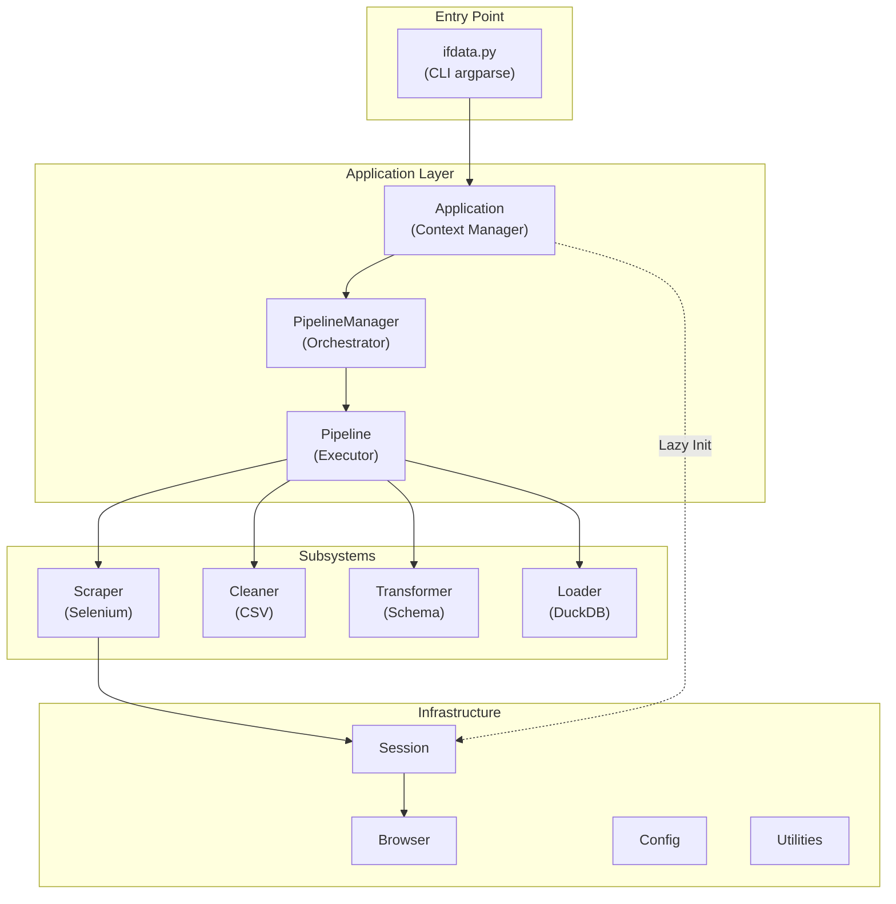
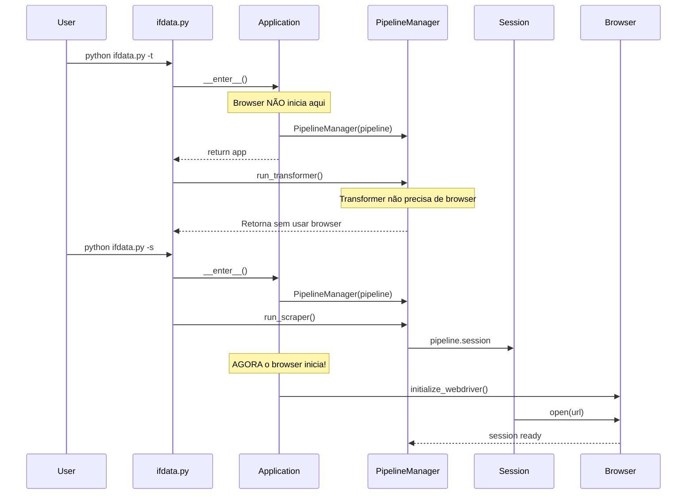

# Arquitetura do Sistema

Este documento descreve a arquitetura, padrões de design e estrutura do projeto **Bacen IF.data AutoScraper & Data Manager**. É destinado a desenvolvedores que desejam entender o funcionamento interno do sistema ou contribuir com seu desenvolvimento.

## Sumário

- [Arquitetura do Sistema](#arquitetura-do-sistema)
  - [Sumário](#sumário)
  - [Visão Geral](#visão-geral)
  - [Stack Tecnológica](#stack-tecnológica)
  - [Arquitetura Geral](#arquitetura-geral)
  - [Padrões de Design](#padrões-de-design)
    - [Lazy Initialization](#lazy-initialization)
  - [Estrutura do Projeto](#estrutura-do-projeto)
  - [Fluxo de Inicialização](#fluxo-de-inicialização)
  - [Subsistemas ETL](#subsistemas-etl)
    - [Scraper (Extract)](#scraper-extract)
    - [Cleaner (Clean)](#cleaner-clean)
    - [Transformer (Transform)](#transformer-transform)
    - [Loader (Load)](#loader-load)
  - [Interfaces e Protocols](#interfaces-e-protocols)
  - [Configurações](#configurações)
  - [Guia de Contribuição](#guia-de-contribuição)
    - [Adicionar Nova Instituição](#adicionar-nova-instituição)
    - [Adicionar Novo Relatório](#adicionar-novo-relatório)
    - [Estilo de Código](#estilo-de-código)
    - [Testes](#testes)
    - [Commits](#commits)
  - [Referências](#referências)


## Visão Geral

O sistema implementa um pipeline **ETL (Extract, Transform, Load)** completo para dados financeiros do Banco Central do Brasil:

| Etapa         | Descrição                                          |
| ------------- | -------------------------------------------------- |
| **Extract**   | Download automático de relatórios CSV via Selenium |
| **Clean**     | Correção de formatação não-padrão dos CSVs         |
| **Transform** | Estruturação dos dados usando schemas Pydantic     |
| **Load**      | Persistência em banco DuckDB para análise          |


## Stack Tecnológica

| Tecnologia | Versão | Propósito                      |
| ---------- | ------ | ------------------------------ |
| Python     | 3.11+  | Linguagem principal            |
| Selenium   | ≥4.16  | Automação do navegador Firefox |
| Polars     | ≥1.32  | Processamento de dados         |
| DuckDB     | ≥1.1   | Banco de dados analítico       |
| Pydantic   | ≥2.9   | Validação de schemas           |
| Pandera    | ≥0.26  | Validação de DataFrames        |
| uv         | -      | Gerenciador de dependências    |


## Arquitetura Geral




## Padrões de Design

| Padrão                  | Implementação                        | Arquivo                                    |
| ----------------------- | ------------------------------------ | ------------------------------------------ |
| **Factory**             | Criação de Application, Transformers | `application.py`, `transformer_factory.py` |
| **Context Manager**     | Gerenciamento do ciclo de vida       | `application.py`                           |
| **Lazy Initialization** | Browser inicia sob demanda           | `application.py`                           |
| **Protocol (DIP)**      | Inversão de dependência              | `interfaces/`                              |
| **Strategy**            | Transformadores por instituição      | `data_transformer/`                        |
| **Registry**            | Mapeamento de relatórios             | `scraper/reports.py`                       |

### Lazy Initialization

O browser só é inicializado quando o scraper é executado:

```python
# application.py
def _get_session(self) -> SessionProtocol:
    if self._session is None:
        self._session = self._initialize_session()  # Browser criado aqui
    return self._session
```

Isso permite executar `cleaner` ou `transformer` sem iniciar o Firefox.


## Estrutura do Projeto

```text
bacen-ifdata-scraper/
├── ifdata.py                    # Ponto de entrada CLI
├── pyproject.toml               # Configuração do projeto
├── data/                        # Dados do pipeline
│   ├── raw/                     # CSVs baixados
│   ├── processed/               # CSVs limpos
│   └── transformed/             # CSVs estruturados
│
├── src/bacen_ifdata/
│   ├── application.py           # Application Factory
│   ├── pipeline.py              # Executor do pipeline
│   ├── manager.py               # Orchestrador
│   │
│   ├── interfaces/              # Protocols (contratos)
│   │   ├── pipeline_manager.py
│   │   └── session.py
│   │
│   ├── scraper/                 # Extração (Selenium)
│   │   ├── session.py
│   │   ├── institutions.py      # Enum de instituições
│   │   ├── reports.py           # Mapeamento de relatórios
│   │   └── interfaces/
│   │
│   ├── data_cleaner/            # Limpeza de CSV
│   │   └── processing.py
│   │
│   ├── data_transformer/        # Transformação
│   │   ├── controller.py
│   │   ├── transformer_factory.py
│   │   ├── schemas/             # Schemas por instituição
│   │   └── transformers/
│   │
│   ├── data_loader/             # Carga (DuckDB)
│   │   └── controller.py
│   │
│   └── utilities/
│       ├── configurations.py    # Config class
│       └── ...
│
├── tests/
└── docs/
```


## Fluxo de Inicialização




## Subsistemas ETL

### Scraper (Extract)

**Diretório:** `src/bacen_ifdata/scraper/`

Automatiza download de relatórios do portal IF.data via Selenium.

**Componentes:**

| Arquivo           | Responsabilidade                          |
| ----------------- | ----------------------------------------- |
| `session.py`      | Gerencia sessão web, dropdowns, downloads |
| `institutions.py` | Enum de tipos de instituições             |
| `reports.py`      | Mapeamento instituição → relatórios       |
| `interfaces/`     | `Browser` e `BrowserProtocol`             |

**Tipos de Instituições:**

- `PRUDENTIAL_CONGLOMERATES`
- `FINANCIAL_CONGLOMERATES`
- `FINANCIAL_CONGLOMERATES_SCR`
- `INDIVIDUAL_INSTITUTIONS`
- `FOREIGN_EXCHANGE`


### Cleaner (Clean)

**Diretório:** `src/bacen_ifdata/data_cleaner/`

Corrige CSVs com formatação não-padrão (múltiplos cabeçalhos, linhas de resumo).


### Transformer (Transform)

**Diretório:** `src/bacen_ifdata/data_transformer/`

Estrutura dados usando schemas definidos por instituição.

**Tipos de Transformação:**

| Tipo          | Descrição            |
| ------------- | -------------------- |
| `NUMERIC`     | Conversão para float |
| `PERCENTAGE`  | Divisão por 100      |
| `DATE`        | Parse de datas       |
| `CATEGORICAL` | Categorização        |
| `TEXT`        | Limpeza de strings   |


### Loader (Load)

**Diretório:** `src/bacen_ifdata/data_loader/`

Carrega dados transformados no DuckDB.


## Interfaces e Protocols

O projeto usa **Protocols** (PEP 544) para Dependency Inversion:

```python
# SessionProtocol
class SessionProtocol(Protocol):
    def open(self) -> None: ...
    def cleanup(self) -> None: ...
    def get_data_bases(self) -> list[str]: ...
    def download_reports(self, data_base: str, institution_type: str, report_type: str) -> None: ...

# PipelineManagerProtocol
class PipelineManagerProtocol(Protocol):
    def run_scraper(self) -> None: ...
    def run_cleaner(self) -> None: ...
    def run_transformer(self) -> None: ...
    def run_loader(self) -> None: ...
```

**Benefícios:**

- Facilita criação de mocks para testes
- Desacopla código de alto nível de implementações
- Documenta contratos de forma explícita


## Configurações

**Arquivo:** `src/bacen_ifdata/utilities/configurations.py`

```python
@dataclass(frozen=True)
class Config:
    URL: str = 'https://www3.bcb.gov.br/ifdata/index2024.html'
    TIMEOUT: int = 120
    BASE_DIRECTORY: Path = Path.cwd()
    DOWNLOAD_DIRECTORY: Path = BASE_DIRECTORY / 'data' / 'raw'
    PROCESSED_FILES_DIRECTORY: Path = BASE_DIRECTORY / 'data' / 'processed'
    TRANSFORMED_FILES_DIRECTORY: Path = BASE_DIRECTORY / 'data' / 'transformed'
```

A classe é `frozen=True` para garantir imutabilidade.


## Guia de Contribuição

### Adicionar Nova Instituição

1. Adicione ao enum em `scraper/institutions.py`
2. Registre relatórios em `scraper/reports.py`
3. Crie schemas em `data_transformer/schemas/<instituicao>/`
4. Registre na factory em `transformer_factory.py`

### Adicionar Novo Relatório

1. Crie enum do relatório (se necessário)
2. Registre no dict `REPORTS`
3. Crie schema correspondente
4. Atualize `__init__.py` dos schemas

### Estilo de Código

| Ferramenta | Configuração            |
| ---------- | ----------------------- |
| Black      | `line-length = 120`     |
| isort      | `profile = "black"`     |
| Pylint     | `max-line-length = 120` |

```bash
# Formatar
uv run black .
uv run isort .

# Lint
uv run pylint src/
```

### Testes

```bash
# Todos os testes
uv run pytest

# Com cobertura
uv run pytest --cov=bacen_ifdata --cov-report=term-missing

# Por marcador
uv run pytest -m unit
uv run pytest -m integration
```

### Commits

Use commits convencionais:

```text
feat: adiciona relatório de crédito
fix: corrige parsing de datas
refactor: extrai lógica de browser
docs: atualiza documentação
test: adiciona testes para cleaner
```

---

## Referências

- [Portal IF.data](https://www3.bcb.gov.br/ifdata/)
- [Selenium Documentation](https://www.selenium.dev/documentation/)
- [Polars User Guide](https://pola.rs/)
- [DuckDB Documentation](https://duckdb.org/docs/)
