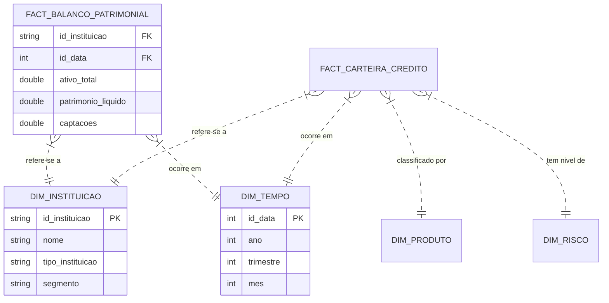

# Pipeline de Transformação de Dados (Silver para Gold)

Este documento detalha o processo de engenharia de dados responsável por transformar os dados brutos carregados no banco de dados (Camada Silver) em um modelo dimensional otimizado para análise e Business Intelligence (Camada Gold).

## Visão Geral

O objetivo deste pipeline é converter os dados fragmentados e heterogêneos dos relatórios do Bacen (que variam por tipo de instituição e data) em um **Star Schema** (Esquema Estrela) unificado. Isso permite análises transversais, como comparar o ativo total de um conglomerado prudencial com uma instituição independente ao longo do tempo.

### Arquitetura de Camadas

| Camada | Tecnologia | Descrição |
| :--- | :--- | :--- |
| **Silver** | DuckDB Tables | Dados brutos carregados diretamente dos CSVs processados e tipados. As tabelas refletem a estrutura original dos arquivos (ex: `prudential_conglomerates_assets`) com tipos de dados corrigidos. |
| **Gold** | DuckDB Tables (via SQL/dbt) | Dados modelados em Dimensões e Fatos. As tabelas são desnormalizadas onde apropriado para performance de leitura (OLAP). |

## Modelagem Dimensional (Gold Layer)

> Para um detalhamento técnico profundo sobre como cada tabela é gerada, leia [Processo de Geração da Camada Gold](GOLD_LAYER_PROCESS.md).

Adotamos a metodologia de Kimball para construção do Data Warehouse.

### Diagrama Conceitual

### Decisões de Design

#### 1. Unificação de Instituições (`dim_instituicao`)

Os relatórios do Bacen separam as instituições em categorias (Conglomerados Prudenciais, Financeiros, Instituições Individuais). No entanto, para análise, frequentemente queremos ver o "Sistema Financeiro" como um todo.

* **Transformação**: Utilizamos `UNION ALL` para combinar as tabelas de resumo (`summary`) de todos os tipos de instituições.
* **Chave Surrogada (Surrogate Key)**: Geramos um `id_instituicao` usando `MD5(CAST(codigo_origem AS VARCHAR))` para garantir unicidade e consistência através das cargas, evitando colisões se códigos se repetirem entre sistemas legados (embora o código Bacen costume ser único).

#### 2. Dimensão de Tempo (`dim_tempo`)

Ao invés de depender de datas em formato string (`"03/2023"`), criamos uma dimensão de tempo numérica.

* **Chave**: Inteiro no formato `YYYYMMDD` (ex: `20230301`).
* **Facilidade**: Permite filtros rápidos por `ano`, `trimestre` sem necessidade de funções de data complexas em tempo de consulta.

#### 3. Fatos Unificados (`fato_balanco_patrimonial`)

O balanço patrimonial é dividido em Ativo e Passivo nos arquivos originais.

* **Join**: Realizamos um `FULL OUTER JOIN` entre as tabelas de Ativo e Passivo baseados em `codigo` e `data_base`.
* **Coalesce**: Campos chave usam `COALESCE` para garantir que o registro exista mesmo que um dos lados do balanço esteja ausente (o que seria uma anomalia de dados, mas o pipeline deve ser resiliente).

## Detalhes das Transformações

As transformações são definidas em arquivos SQL localizados em `src/bacen_ifdata/data_analytics/models/gold`.

### Dimensões (`dim_*.sql`)

| Tabela | Transformação Principal |
| :--- | :--- |
| `dim_instituicao` | Consolidação de 5 fontes (Prudencial, Financeiro, Individual, Câmbio, SCR Fallback). Normalização de localização e chaves de segmento. |
| `dim_tempo` | Geração dinâmica de datas baseada nas datas distintas encontradas nas tabelas de fatos. |
| `dim_produto_credito` | Mapeamento estático (Seed) normalizando nomes de produtos de crédito. |
| `dim_risco` | Mapeamento de níveis de risco (AA-H, HH) para descrições legíveis. |

### Fatos (`fato_*.sql`)

| Tabela | Transformação Principal |
| :--- | :--- |
| `fato_balanco_patrimonial` | Join de Assets + Liabilities. Seleção das colunas mais relevantes (Ativo Total, PL, Captações). |
| `fato_demonstracao_resultado` | Consolidação de Income Statement. Foco em Lucro Líquido e Resultado Operacional. |
| `fato_capital_prudencial` | Consolidação de informações de capital (Basileia, PR, Capital Principal) de conglomerados. |
| `fato_movimentacao_cambio` | Dados de fluxo cambial (comercial, financeiro) por instituição. |
| `fato_carteira_credito_*` | Tabelas "Narrow" (longas) segmentadas por Produto, Atividade, Risco, Indexador, etc. |

## Como Atualizar ou Estender

O projeto segue a estrutura do **dbt (data build tool)**, embora possa ser executado diretamente via DuckDB se necessário.

1. **Novas Dimensões**:
    * Crie o arquivo `.sql` em `models/gold`.
    * Defina a lógica de extração da camada `silver`.
    * Recomenda-se usar CTEs (`WITH`) para limpar os dados antes do `SELECT` final.

2. **Novas Colunas na Silver**:
    * Se um novo dado foi adicionado ao scraper/schema Python, ele aparecerá automaticamente na tabela Silver.
    * Atualize o SQL da camada Gold correspondente para incluir a nova coluna.

## Justificativa Tecnológica

* **SQL Declarativo**: A lógica de negócio fica encapsulada em SQL, facilitando a leitura por analistas de dados e engenheiros de analytics.
* **DuckDB**: Processamento vetorizado in-process. Permite transformar milhões de linhas em segundos na máquina local, sem necessidade de infraestrutura pesada (Spark/DW Cloud).
* **Separação Silver/Gold**: Permite reprocessar a camada Gold (regras de negócio) sem precisar refazer o scraping ou parsing dos arquivos (camada Silver), economizando tempo e recursos.
