# Processo de Geração da Camada Gold (ETL & Modelagem)

Este documento detalha tecnicamente como os dados são transformados da Camada Silver para o Esquema Estrela da Camada Gold.

## Visão Geral do Fluxo de Dados

O processo de construção da Camada Gold segue um fluxo lógico de **Unificação de Dimensões** seguido pela **Geração de Fatos**. O objetivo é garantir que toda transação nas tabelas de fatos tenha chaves correspondentes nas tabelas de dimensão (Integridade Referencial).

```mermaid
flowchart TD
    subgraph Silver Layer [Camada Silver]
        S_PRUD[Prudential Sources]
        S_FIN[Financial Sources]
        S_IND[Individual Sources]
        S_SCR[SCR Portfolio Sources]
        S_EXCH[Exchange Sources]
    end

    subgraph Dimensions [Geração de Dimensões]
        DIM_INST[[dim_instituicao]]
        DIM_TEMPO[[dim_tempo]]
        SEEDS[(Seeds: Classes, Segmentos, etc)]
    end

    subgraph Facts [Geração de Fatos]
        F_BALANCO[fato_balanco_patrimonial]
        F_DRE[fato_demonstracao_resultado]
        F_CAPITAL[fato_capital_prudencial]
        F_CREDITO[fato_carteira_credito_*]
        F_CAMBIO[fato_movimentacao_cambio]
    end

    %% Flow to Dimensions
    S_PRUD & S_FIN & S_IND & S_SCR & S_EXCH -->|UNION ALL + Distinct| DIM_INST
    S_PRUD & S_FIN & S_IND & S_SCR & S_EXCH -->|Extract Dates| DIM_TEMPO
    SEEDS --> DIM_INST

    %% Flow to Facts
    S_PRUD & S_FIN & S_IND -->|Join Assets/Liabilities| F_BALANCO
    S_PRUD & S_FIN & S_IND -->|Union Income Data| F_DRE
    S_PRUD & S_FIN -->|Union Capital Data| F_CAPITAL
    S_FIN & S_SCR -->|Unpivot & Normalize| F_CREDITO
    S_EXCH --> F_CAMBIO

    %% Linking
    DIM_INST -.-> Facts
    DIM_TEMPO -.-> Facts
```



---

## 1. Geração das Dimensões

### dim_instituicao: A Unificação do Universo Bancário

A tabela `dim_instituicao` é o coração do modelo. Ela unifica identidades de instituições que aparecem em relatórios disparatos.

* **Estratégia**: `UNION ALL` com priorização.
* **Fontes**:
    1. **Prudencial**: Conglomerados prudenciais (visão de risco global).
    2. **Financeiro**: Conglomerados financeiros (visão corporativa).
    3. **Individual**: Instituições reportando individualmente.
    4. **Câmbio**: Instituições autorizadas a operar câmbio.
    5. **SCR Fallback**: Instituições que aparecem apenas nos relatórios de crédito (SCR) mas não nos resumos contábeis.
* **Normalização de Atributos**:
  * **IDs de Referência**: Colunas como `segmento`, `consolidado_bancario`, e `tipo_de_instituicao` (Classe) são transformadas em Foreign Keys (`id_segmento`, `id_consolidado`, `id_classe`) apontando para tabelas de domínio estáticas (Seeds).
  * **Tratamento de Texto**: Uso de `lower()` e `md5()` para garantir que variações de caixa (ex: "B3C" vs "b3c") gerem o mesmo ID.

### dim_tempo: O Calendário Mestre

Para garantir que análises temporais nunca falhem por buracos nas datas.

* **Estratégia**: Coleta de TODAS as datas (`data_base`) distintas presentes em TODAS as tabelas da camada Silver.
* **Resultado**: Uma linha do tempo completa que cobre desde o relatório mais antigo até o mais recente, independente de qual instituição reportou.

---

## 2. Geração dos Fatos Contábeis

### fato_balanco_patrimonial

Consolida a visão de posição financeira (o que a instituição tem e deve).

* **Desafio**: Os relatórios originais separam "Ativo" e "Passivo" em tabelas diferentes na Silver.
* **Solução**:

    ```mermaid
    flowchart LR
        Assets[Silver: Assets]
        Liabilities[Silver: Liabilities]
        
        Assets & Liabilities -->|FULL OUTER JOIN on Instituicao + Data| Gold[fato_balanco_patrimonial]
    ```

* **Agregação**: Unificamos colunas chave como `ativo_total`, `patrimonio_liquido` e `captacoes_totais` em uma única tabela larga.

### fato_demonstracao_resultado

Consolida a performance financeira (lucro/prejuízo) do período.

* **Origem**: `*_income_statement` (Prudential, Financial, Individual).
* **Lógica**: União direta das métricas de performance. Inclui colunas calculadas na origem (quando disponíveis) ou preserva os valores brutos para cálculo de KPIs no BI (ex: ROE, ROA).

---

## 3. Geração dos Fatos de Crédito (SCR & Padrão)

As tabelas de crédito são as mais complexas devido à granularidade e volume.

### Unificação SCR + Padrão

Muitas visões de crédito possuem dois relatórios: o padrão (contábil) e o SCR (Sistema de Informações de Crédito, mais granular).

* **Estratégia**: Ambas as fontes são unidas (`UNION ALL`) nas tabelas fato.
* **Distinção**: Embora unificadas, a origem é rastreável implicitamente pelo tipo da instituição ou explicitamente se adicionarmos uma flag de fonte. No modelo atual, a unificação permite somar a exposição total de crédito do sistema independente da fonte regulatória.

### Normalização via UNPIVOT (Ex: Carteira por Atividade)

Alguns relatórios Silver chegam "pivotados" (colunas como `comercio`, `industria`, `servicos`). Para o modelo Star Schema, precisamos disso no formato "longo" (Narrow).

* **Processo**:
    1. **Leitura**: Lê a tabela Silver (ex: `portfolio_legal_person_economic_activity`).
    2. **Unpivot**: Transforma as colunas de atividades em linhas.
        * Antes: `| Inst A | Comércio: 100 | Indústria: 200 |`
        * Depois:
            * `| Inst A | Atividade: Comércio | Valor: 100 |`
            * `| Inst A | Atividade: Indústria | Valor: 200 |`
    3. **Link**: A coluna de texto "Comércio" é vinculada à `dim_atividade` para gerar um `id_atividade`.

**Fatos gerados por este processo**:

* `fato_carteira_credito_atividade`
* `fato_carteira_credito_porte`
* `fato_carteira_credito_modalidade` (via tabelas type_maturity)

---

## 4. Garantia de Qualidade (Data Quality)

O processo de build inclui testes automáticos (`dbt test`) que verificam:

1. **Unique Keys**: Se as chaves primárias compostas (`id_instituicao` + `id_data` + ...) são únicas.
2. **Not Null**: Se campos obrigatórios estão preenchidos.
3. **Relationships**: Se todos os IDs (instituição, segmento, classe) nas tabelas fato existem nas tabelas de dimensão. Isso garante que nunca tenhamos um saldo órfão sem saber a quem pertence.
